# Delivery and Transport Services 

Welcome to [Safe-Transport website!](https://mihaielisei.github.io/transport-services/)

# Introduction

Delivery and Transport Services is a company that offers delivery and transportation services for both individuals and other companies. These services consist of transporting various types of goods from small packages such as letters to large packages such as furniture or appliances.
Our services are available throughout entire country of Ireland!

The aim of this project is to create a website that presents the services of this company in an attractive and simple way for users to navigate on it.

Live version of the website: [Safe Transport](https://mihaielisei.github.io/transport-services/)

# Table of Contents

# 1. User Expereince (UX) design

The website has been created in such a way that users can easily navigate from one page to another and the information presented is visible, easy to understand and easy to find.

The following users types can be benifitted from the website:

* Individuals who need transportation in case of a change of home or any other personal needs;
* Large and medium-sized companies that need contractors to provide them with daily transportation of goods or deliveries.

# 1.1 User Goals

The main purpose of this website is to present the services offered by the company in order to obtain new contracts and collaborations with potential clients.

# 1.2 User Expectations 

The content of this website presents the services offered by a product delivery company. This website is ideal for people who are planning to start a small business and want to present their services online. Folloiwng user's expections ware considered while designing the site:

* The site structure is designed considering the expectation of users to be simple and easy to use;
* The user interface is easy to navigate;
* Responsive design for all screen/device sizes like mobile, tablet and desktop;
* A application page is provided for those users who will be contacted if they are interested in company services.

# 1.3 Color Scheme

The choice of website right foreground and background colour is essential that decides the site visitors wheather to emote the site or not. I used [Color Hunt](https://colorhunt.co/) to select the background and foreground color. Colors that i used are:

 * #614124 - for text and footer background;
 * rgba(159, 192, 136, .8) and rgba(232, 192, 125, .8) : a linear gradient with opacity of 0.8 over the hero image;
 * #E8C07D - for main content background;

# 1.4 Images and Logo

This website was created for academic purposes, all photos were searched and downloaded from the google platform and the logo was created and downloaded from [Looka](https://looka.com).

# 1.5 Site Skeleton
[Balsamiq](https://balsamiq.com/) was used to create wireframes of the website. This was very useful as it gives the template of the UI. Wireframes were designed for web browser and a mobile browser format:

## Header:
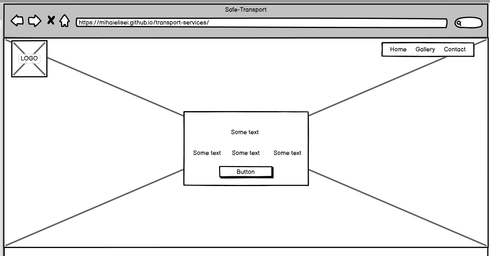

## Home Page:
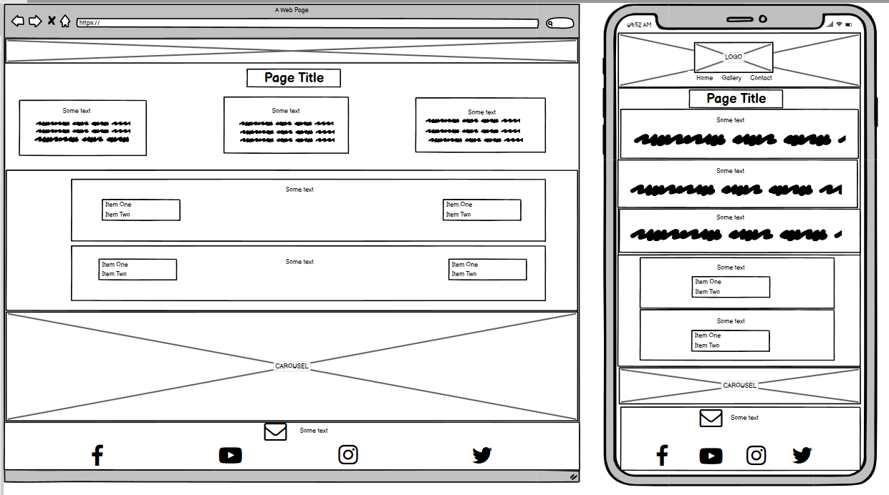

## Gallery Page:
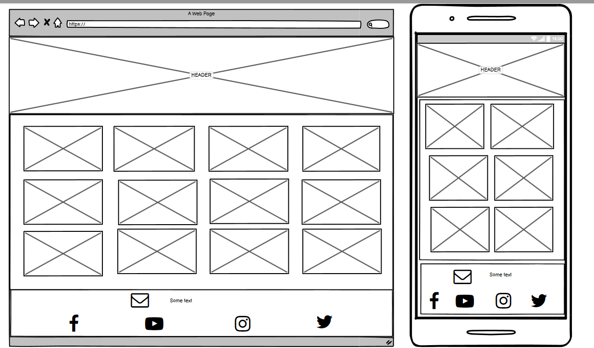

## Contact Page:
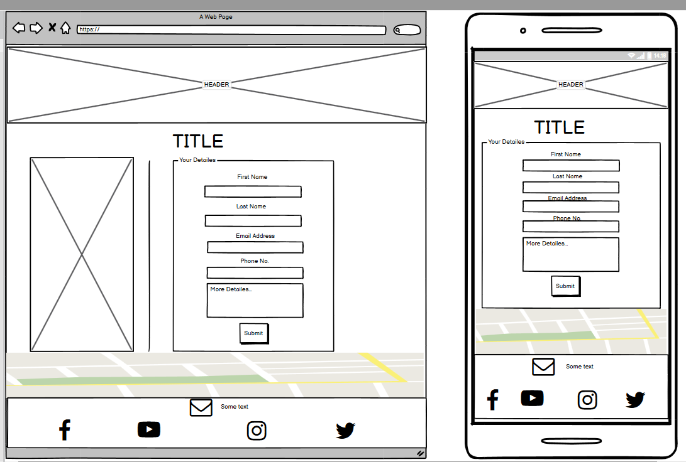

# 2.Features

## All 3 pages:

* Navigation bar is placed at the top right corner of the page, and cosnidered a hover effect that changes the font size of menu items and add bottom border. The hover effect is placed to improve the user expereince. Background color for the navigation menu is white with a 0.4 opacity;
* Logo is placed on the top left corner;
* Header background is an image with two color over it (linear-gradient) with 0.8 opacity. This makes the background look modern and attractive to users.
* For page title and small presentation i have created animations to make text translate and change it`s opacity;
* Social media links (Facebook, Instagram, Twitter and Youtube) are placed at the bottom of the each page in the footer. All the links will be opened in a new tab.

## Home Page

* In addition to the other pages in the header part of the home page under the title and the presentation text, we have created a button that leads to the services section. When hover the button this will translate a few px up and create an box shadow;
* I used for the whole website but especially for the home page the clip path property to create nice polygons and give the website a nice design;
* In policies section every division have a hover effect that translate the division and create a box shadow;
* In the bottom of the page i used bootstrap 5.2 framework to import and create a carousel.

The screenshots of Home page are below:

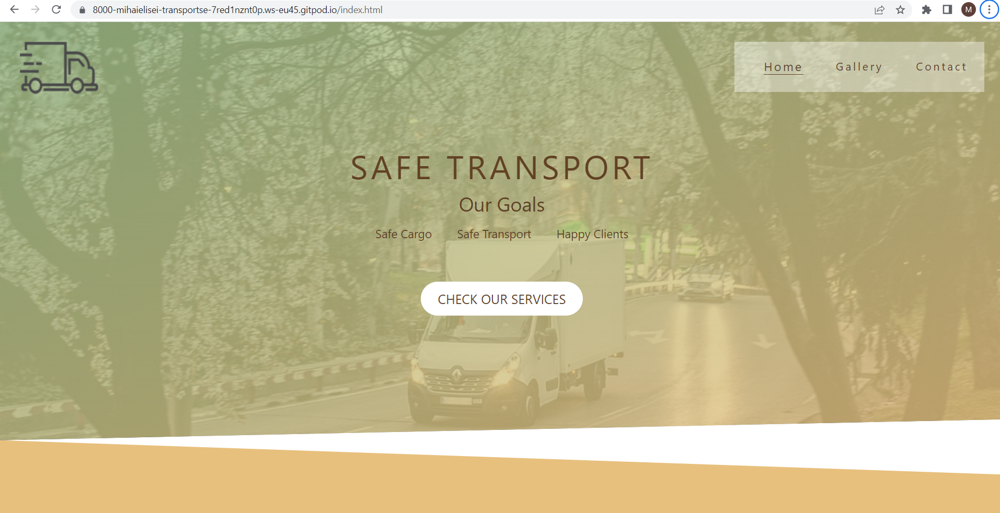
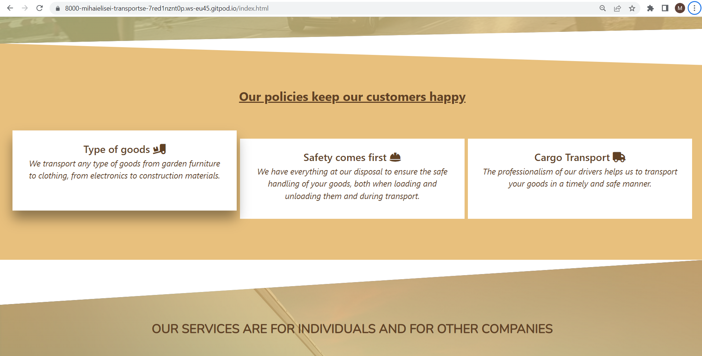
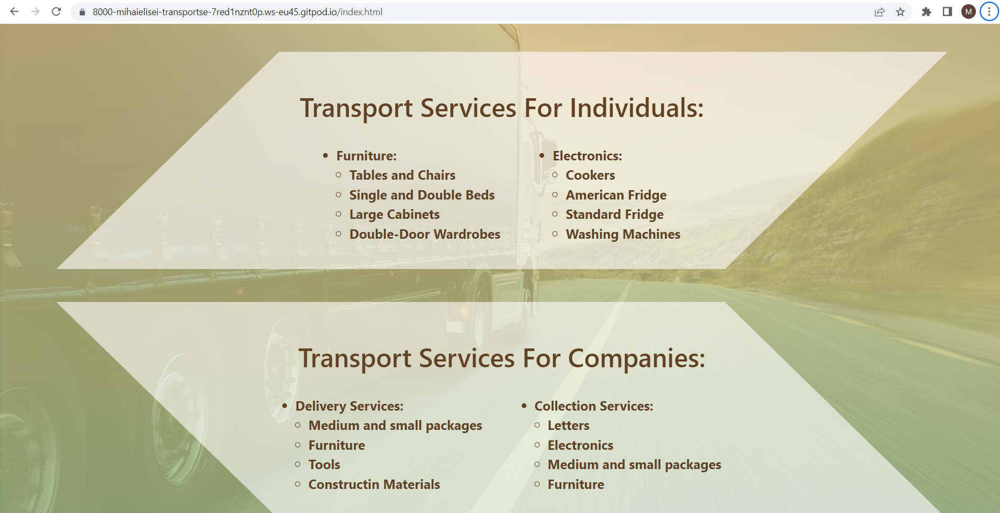
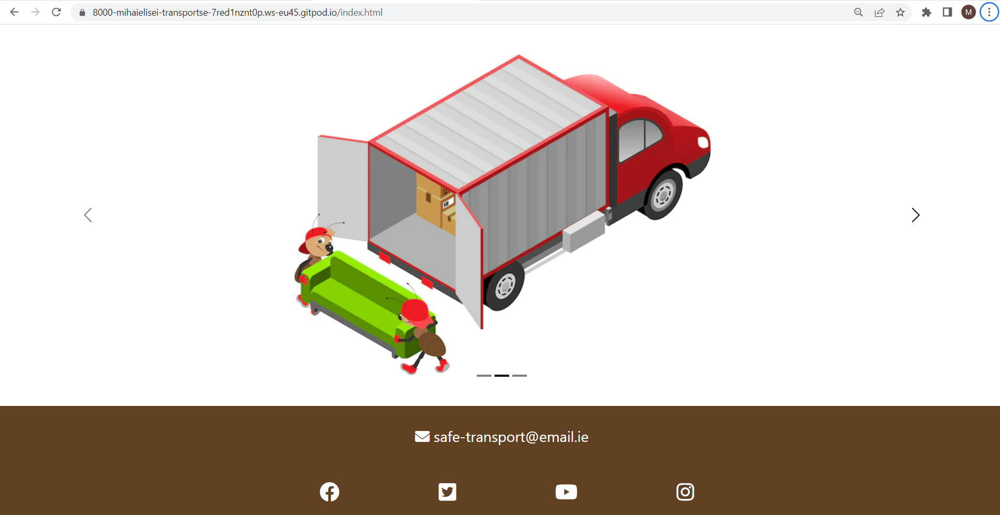

## Gallery page
* For gallery section i used clip path to create a nice design to the page;
* For gallery i used the code from Love Running project;
* every image in the gallery have a hover effect of increasing the size with 10%.

The screenshot of Gallery page is below:
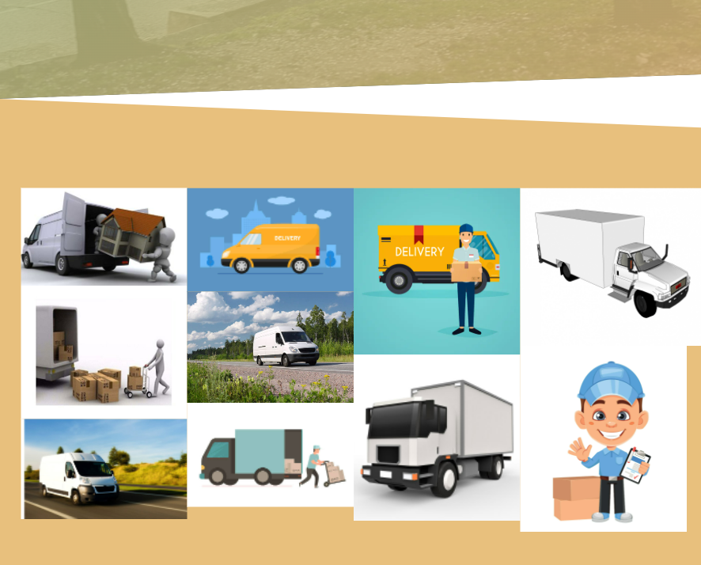

## Contact page
* Include contact form that provides the user the ability to message site owner, provide feedback and suggestions.
* For contact section i used clip path to create a nice design to the page;
* Left image have a hover effect that rotates the img with 180deg (this will create a good experience for users while navigate on the website);
* Hover effect for submit button;
* The form use the method="POST" action="https://formdump.codeinstitute.net/";
* I use the placeholder attribute for textarea;
* I added iframe with Dublin City map (as an general address).

The screenshot of Gallery page is below:
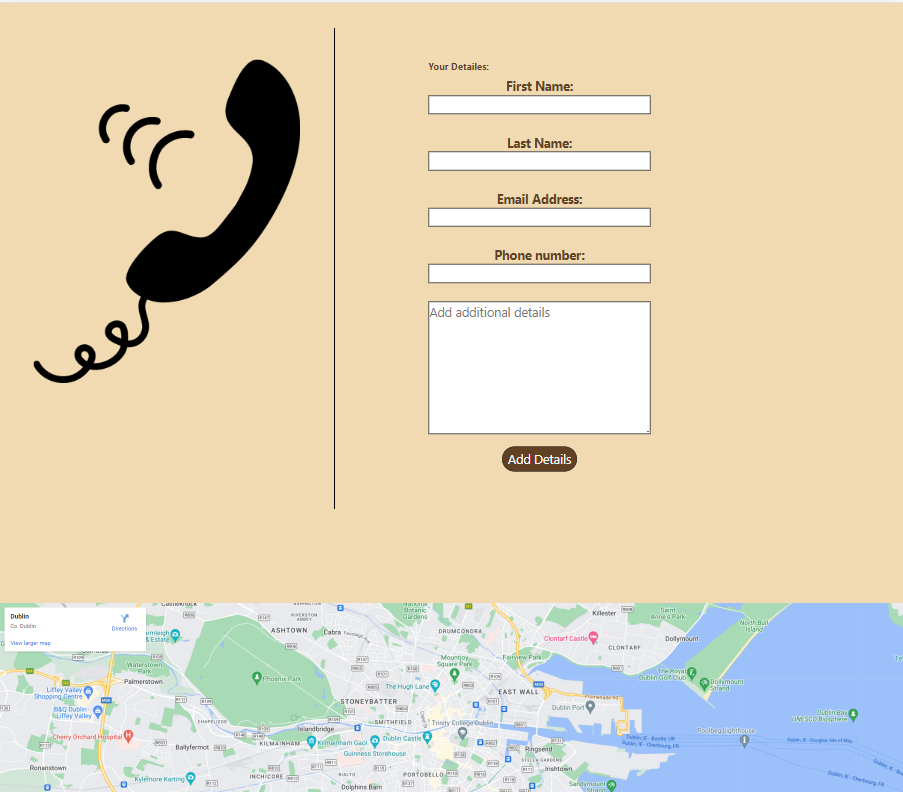
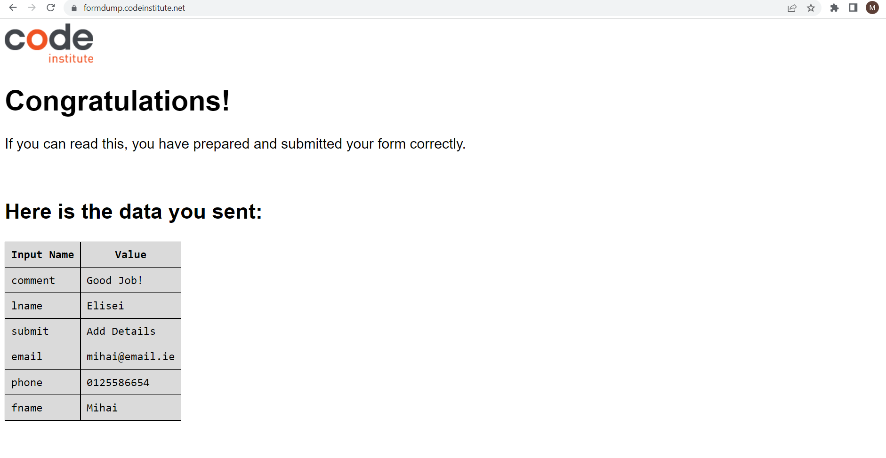

# 3. Technologies Used

* HTML5 was used for structuring and presenting content of the website;
* CSS3 was used to provide the style to the content written in a HTML;
* Balsamiq was used to create wireframes of the website;
* Google Fonts was used to import font-family "Nunito" and "Ubuntu" into style,css file and which was used throughout the pages of the website;
* Font Awsome was used to improt icons to the sites;
* Chrome was used to debug and test the source code using HTML5 as well as to test site responsiveness;
* Github was used to create the repository and to store the cproject's code after pushed from Git;
* Git was used as the Code Editor for the site;
* Color Hunt was used to select the background and font color in the website;
* W3C Markup and Jigsaw validation tools were used to validate the HTML code and CSS style used in the proejct;
* Ami was used to develop a Mockup screenshot generator.

# 4. Testing

## 4.1 Testing tools:
* Google Developer Tools for debug and test css code;
* [I Am Responsive](https://ui.dev/amiresponsive) site to check if website is responsive on all devices screen sizes;
* W3C Validator Tools was used to check for any errors within my HTML pages:
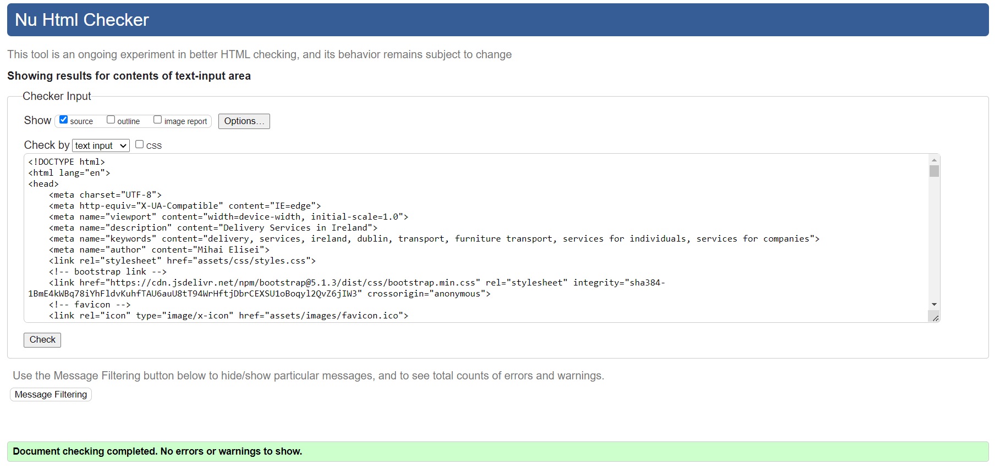
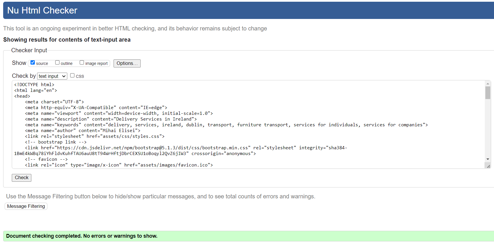
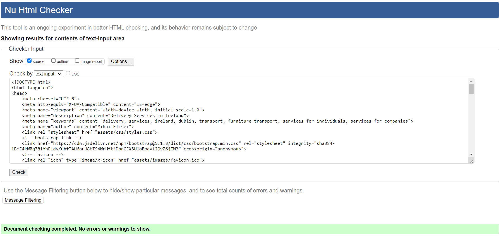
* W3C CSS Validation was used to check for any error within my CSS stylesheet:
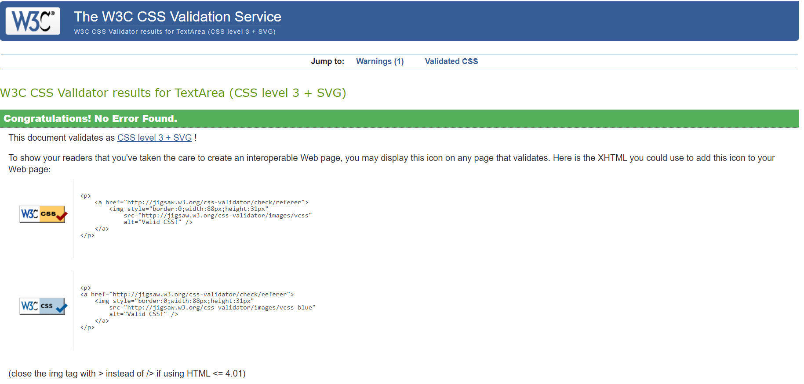

## 4.2 Manual Testing

I have tested my site on multiple devices. These include:
* Galaxy Fold (280 x 653);
* Iphone 6/7/8 Plus (414 x 736);
* Ipad (768 x 1024);
* Nest Hub (1024 x 600);
