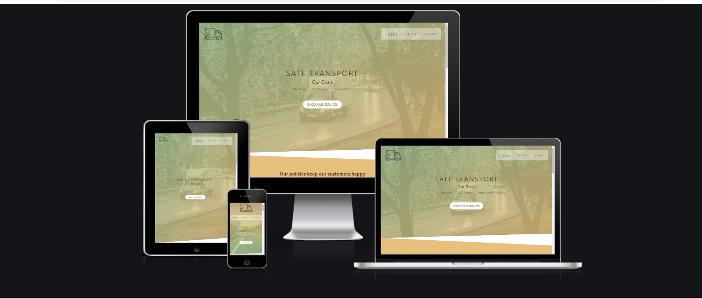

# Delivery and Transport Services 

Welcome to [Our website!](https://mihaielisei.github.io/transport-services/)

# Introduction

Delivery and Transport Services is a company that offers delivery and transportation services for both individuals and other companies. These services consist of transporting various types of goods from small packages such as letters to large packages such as furniture or appliances.
Our services are available throughout entire country of Ireland!

The aim of this project is to create a website that presents the services of this company in an attractive and simple way for users to navigate on it.

Live version of Our website: [Safe Transport](https://mihaielisei.github.io/transport-services/)

# Table of Contents

# 1. User Expereince (UX) design

The website has been created in such a way that users can easily navigate from one page to another and the information presented is visible, easy to understand and easy to find.

The following users types can be benifitted from the website:

* Individuals who need transportation in case of a change of home or any other personal needs;
* Large and medium-sized companies that need contractors to provide them with daily transportation of goods or deliveries.

# 1.1 User Goals

The main purpose of this website is to present the services offered by the company in order to obtain new contracts and collaborations with potential clients.

# 1.2 User Expectations 
